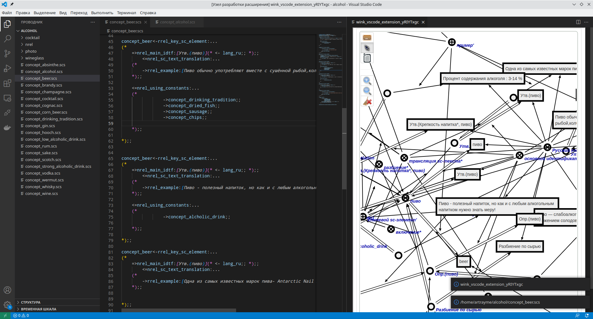
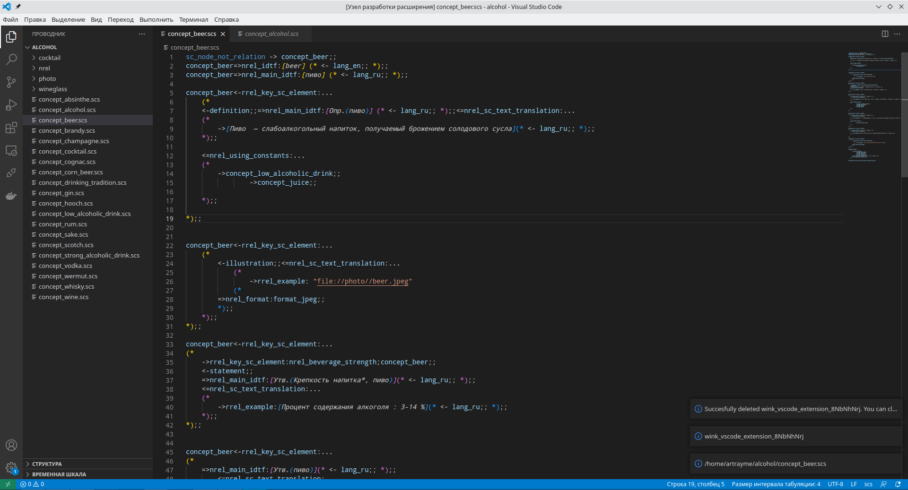

# WINK-vscode-extension
VScode extension for SCs language support. Original project - [vs-code-ostis](https://github.com/ostis-dev/vs-code-ostis)

# Features
1. SCs highlighting 
2. SCs snippets
3. Autocompletion (simple provider)
4. Uploading SCs to sc-machine 
5. Window with Sc-web (also with uploaded SCs)

# How to use 
The description can be found in the original project. 
But there are some new features in this project. You should run ostis to get them.
Important note: Use ctrl+shift+p to open the VScode command finder.

## Upload active SCs to sc-machine and check it using sc-web.

Open any file with the correct SCs code and open the command finder.
Find the command "Save current SCs to the connected sc-machine" and click on it. 
Your SCs will be downloaded to the sc-machine and a new window with SCg will open in VScode.
<p align="center">
  
</p>

## Unload loaded SCs.
Open the loaded(!!!) SCs. 
Find the command "Delete current SCs from the connected sc-machine" and click on it.
Your SCs will be deleted from the sc-machine. But this function is not really needed, because when you load SCs again, it will automatically be deleted and loaded again.
And it will also automatically close the sc-web window for deleted SCs.
<p align="center">
  
</p>

## Upload all SCs files from your project.
Find the command "Save all scs files from the open project to sc-machine".
You will then be able to find all your entities in sc-machine. You can use sc-web in VScode or in the browser.

## Unload all loaded SCs from sc-machine.
Find the command "Delete all SCs from the connected sc-machine".
This will delete all previously downloaded SCs from the sc-machine. 

# For developers 

## How to configure and run

First of all, you need a vs-code with the latest updates (no older than May 2022 due to the project's use of the new tab API). After that, follow the steps: 

1. Install all dependencies 
``` shell
npm install
```
2. Compile project (this step is required after any changes )
```
npm run compile
```
3. Open file extension/src/extension and click F5. After that, either a new window with the activated plug-in should open immediately, or a configuration selection menu will open where you should select "VS extension development" or something similar

## How to debug
To debug the extension code, all you need to do is set breakpoints and run the extension. 

To debug the LSP, you need to connect to the NodeJS process, as the LSP does not run on the same js engine as the extension. 

ToDo full instruction) But you can check this repo https://github.com/microsoft/vscode-extension-samples 

<!-- # Notes for developers (for me)
1. I will split project by 2 git submodules after the development is completed. 
2. I will add webpack config.
3. It is a bad idea to generate JS implementation of the ANTLR parser. You need to add some configuration to link JS files from TS and JS files from ANTLR. Maybe this issue can be solved by webpack, but this is a waste of time, as it provides nearly no benefits.  -->

